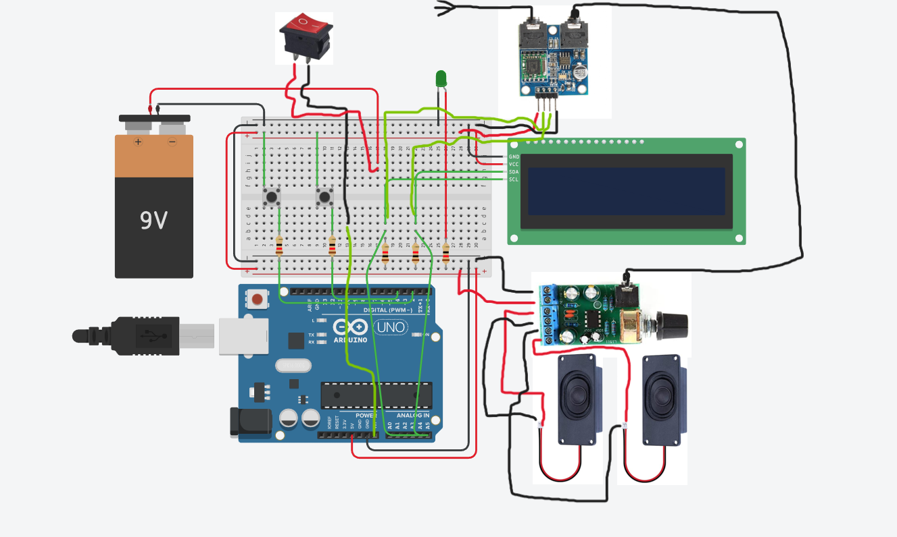
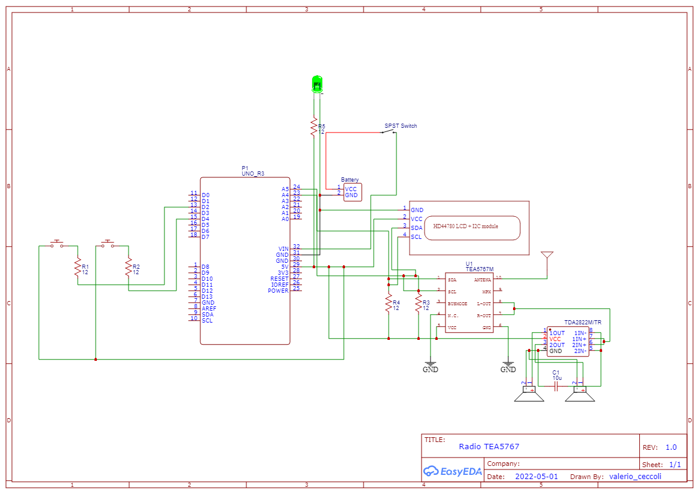

# 📻 Radio Arduino Uno TEA5767

An FM radio built using an **Arduino Uno** and the **TEA5767** radio module.  
It displays the current frequency on an I²C 16×2 LCD display, allows tuning via buttons, stores the last frequency in EEPROM, and outputs audio to speakers via an amplifier.  

---

## 📌 Overview

- **Objective**: Build a working FM radio using Arduino and TEA5767 receiver.  
- **Features**:
  - Tuning up/down via two push buttons  
  - Display current frequency on I²C LCD  
  - Store & recall last frequency from EEPROM  
  - Audio output via amplifier to speakers  
  - On/off switch to activate/deactivate radio  

---

## 🛠 Hardware Requirements

| Component | Quantity | Purpose |
|-----------|----------|---------|
| Arduino Uno (or compatible) | 1 | Main microcontroller |
| TEA5767 FM radio module | 1 | FM receiver |
| I²C 16×2 LCD display | 1 | To show current frequency |
| 2 × Push Buttons | 2 | For tuning up/down |
| 5 mm LED | 1 | Indicator (e.g. power or backlight) |
| Speaker(s) (8 Ω, ~3 W) | 1 or 2 | Audio output |
| Amplifier (e.g. TDA2822M) | 1 | Audio signal amplification |
| Jumper wires / connectors | — | Electrical connections |
| Breadboard / prototyping board | 1 | Mounting / wiring |
| SPST switch | 1 | Power on/off radio |
| Resistors (e.g. 12 Ω) | Several | For LED or other signal lines |
| 9 V adapter or battery | 1 | Power supply |
| 9 V battery (optional) | 1 | Alternate power source |

---

## 💻 Software / Libraries

- **Arduino IDE** (or other compatible environment)  
- Required libraries:
  - `Wire` (for I²C)  
  - `LiquidCrystal_I2C`  
  - `TEA5767N` (or TEA5767) library :contentReference[oaicite:1]{index=1}  
  - `EEPROM` (built-in)  

---

## ⚡ Circuit Diagram

Here is the wiring layout for the radio setup:

